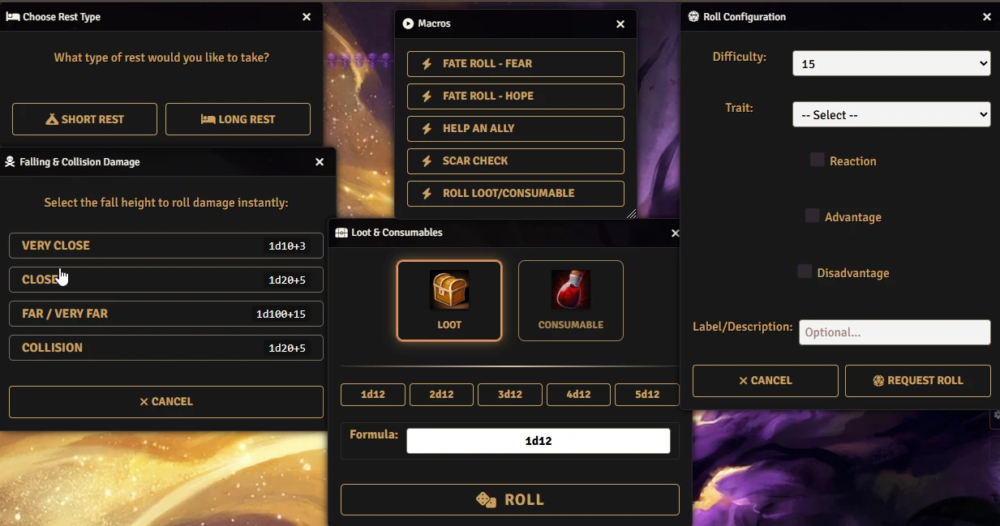
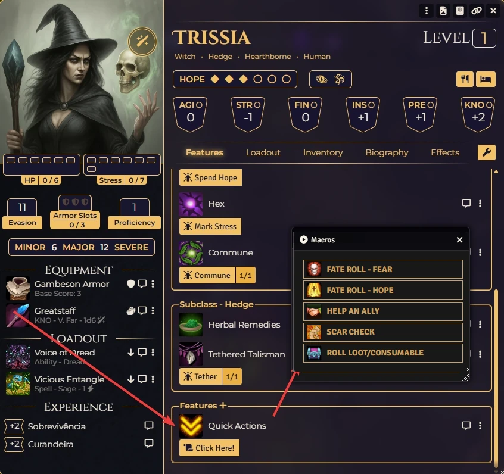

# Daggerheart: Quick Actions

**Essential tools and automations for Daggerheart in Foundry VTT.**

This module streamlines the flow of gameplay by providing quick access to common mechanics like Falling Damage, Downtime moves, Scar Checks, and Loot rolling, integrated directly into the Daggerheart system interface.

<p align="center"></p>

<p align="center"></p>

## 🌟 Features

### 🛠️ Core Utilities

* **🛌 Downtime & Fear:** Automatically calculates and adds Fear to the GM's resource pool based on Short or Long Rests (1d4 or 1d4 + PCs).
* **💀 Falling & Collision Damage:** Instant damage roller for environmental hazards. Supports "Very Close", "Close", "Far", and "Collision" damage tiers with automatic dice calculations.
* **🎲 Request Roll:** A GM tool to quickly request rolls from players to the chat, configuring Difficulty, Traits, Advantage/Disadvantage, and context labels.
* **💰 Loot & Consumables:** A dedicated interface to roll on Loot or Consumable tables from your compendiums, complete with custom dice formulas.

### 🎭 Token Macros

* **🤝 Help an Ally:** Checks the selected token's **Hope** resource. If available, consumes 1 Hope and rolls the Help Die (1d6) to the chat.
* **❤️ Scar Check:** Automatically checks the actor's Level against a 1d12 roll to determine if they are Safe or take a Scar.
* **🔦 Spotlight Token:** Instantly changes the active combat turn to the selected token (requires active combat).

### 🕹️ Interface Integration

* **Sidebar Menu:** Adds a "Quick Actions" section to the Daggerheart System Menu for easy access.
* **Macro Palette:** Create custom palettes of macros using `QuickActions.ShowMacros()`.

## ⚙️ Usage

### Via Sidebar
Go to the **Daggerheart Menu** in the sidebar. You will see a new section titled **Quick Actions** with buttons for:
* Earn Fear (Downtime)
* Falling Damage
* Request Roll

### Via API / Macros
You can trigger any function programmatically or via Foundry Macros using the global `QuickActions` object:

```javascript
// Opens the Downtime interface
QuickActions.Downtime();
```

```javascript
// Opens the Falling Damage calculator
QuickActions.FallingDamage();
```

```javascript
// Opens the Roll Request dialog
QuickActions.RequestRoll();
```

```javascript
// Opens the Loot & Consumables roller
QuickActions.LootConsumable();
```

```javascript
// Performs "Help an Ally" on the selected token
QuickActions.HelpAnAlly();
```

```javascript
// Performs a "Scar Check" on the selected token
QuickActions.ScarCheck();
```

```javascript
// Sets the combat turn to the selected token
QuickActions.SpotlightToken();
```

```javascript
// Opens a dialog with buttons for specific macros by name
// Requires macros to exist in the 'daggerheart-quickactions.macros' compendium
QuickActions.ShowMacros("Macro Name 1", "Macro Name 2");
```

## 📦 Installation

Install via the Foundry VTT Module browser or use this manifest link:

```javascript
https://raw.githubusercontent.com/brunocalado/daggerheart-quickactions/main/module.json
```

## ⚖️ Credits & License

* **License:** MIT License.
* **System:** Designed for the [Daggerheart](https://www.daggerheart.com) system on Foundry VTT.
* **Assets:** AI images provided are [CC0 1.0 Universal Public Domain](https://creativecommons.org/publicdomain/zero/1.0/).
* **sfx-critical:** [https://pixabay.com/service/license-summary/](https://pixabay.com/service/license-summary/)

**Disclaimer:** This module is an independent creation and is not affiliated with Darrington Press.

# 🧰 My Daggerheart Modules

| Module | Description |
| :--- | :--- |
| 💀 [**Adversary Manager**](https://github.com/brunocalado/daggerheart-advmanager) | Scale adversaries instantly and build balanced encounters in Foundry VTT. |
| ☠️ [**Death Moves**](https://github.com/brunocalado/daggerheart-death-moves) | Enhances the Death Move moment with immersive audio and visual effects. |
| 📏 [**Distances**](https://github.com/brunocalado/daggerheart-distances) | Visualizes combat ranges with customizable rings and hover calculations. |
| 🤖 [**Fear Macros**](https://github.com/brunocalado/daggerheart-fear-macros) | Automatically executes macros when the Fear resource is changed. |
| 😱 [**Fear Tracker**](https://github.com/brunocalado/daggerheart-fear-tracker) | Adds an animated slider bar with configurable fear tokens to the UI. |
| 🛒 [**Store**](https://github.com/brunocalado/daggerheart-store) | A dynamic, interactive, and fully configurable store for Foundry VTT. |
| 📦 [**Extra Content**](https://github.com/brunocalado/daggerheart-extra-content) | Homebrew for Daggerheart. |
| ⚡ [**Quick Actions**](https://github.com/brunocalado/daggerheart-quickactions) | Quick access to common mechanics like Falling Damage, Downtime, etc. |
| 📜 [**Quick Rules**](https://github.com/brunocalado/daggerheart-quickrules) | Fast and accessible reference guide for the core rules. |

# 🗺️ Adventures

| Adventure | Description |
| :--- | :--- |
| ✨ [**I Wish**](https://github.com/brunocalado/i-wish-daggerheart-adventure) | A wealthy merchant is cursed; one final expedition may be the only hope. |
| 💣 [**Suicide Squad**](https://github.com/brunocalado/suicide-squad-daggerheart-adventure) | Criminals forced to serve a ruthless master in a land on the brink of war. |