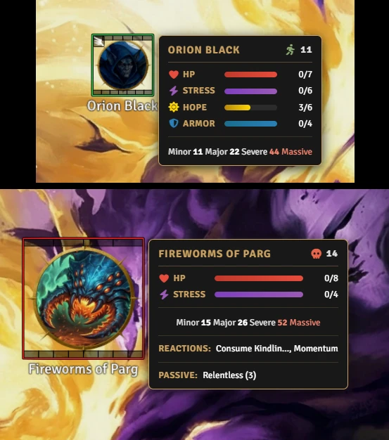
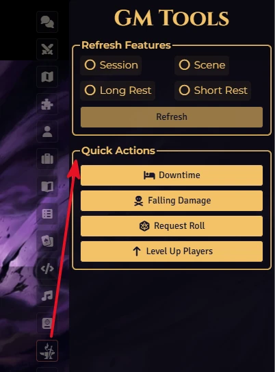

# Daggerheart: Quick Actions

**Essential tools and automations for Daggerheart in Foundry VTT.**

This module streamlines the flow of gameplay by putting the most common Daggerheart mechanics — Downtime, Falling Damage, Roll Requests, Loot, Scar Checks, and more — one click away, integrated directly into the Daggerheart system interface.

<p align="center"></p>

<p align="center"></p>

<p align="center"></p>

<p align="center"></p>


[](https://buymeacoffee.com/mestredigital) [](https://mestredigital.online/pages/projetos-en)

## 🌟 Features

### 🛌 Downtime

* **Downtime UI:** A full-screen manager for downtime moves. Players pick their moves (Tend to Wounds, Prepare, Work a Trade, and more, including any homebrew moves the GM adds), the same move can be chosen more than once when the rules allow it, and the GM resolves everything — resource costs, Fear gained, and rest results — with one click. Automatically handles class/subclass features that hook into downtime, such as Efficient, Forager, Recovery, Armorer, Celestial Trance, Premium Bedroll, Eloquent, and Soothing Speech.
* **Quick Earn Fear:** A lightweight "Short Rest / Long Rest" dialog for GMs who just want to roll Fear without opening the full Downtime UI.

### 🛠️ GM Utilities

* **🪂 Falling & Collision Damage:** Instant damage roller for environmental hazards. Supports "Very Close", "Close", "Far/Very Far", and "Collision" tiers, with dice formulas the GM can fully customize.
* **🎲 Request Roll:** Quickly ask one or more players to make a roll. Configure Difficulty, Trait, Advantage/Disadvantage, and a context label; optionally send it as a "cinematic" full-screen prompt.
* **💬 Whisper:** Send a private message to any number of connected users, via `QuickActions.Whisper()`. Pick the recipients from the list (GMs are flagged with a crown), type the message, and hit send — it arrives as a whispered chat card visible only to them. The text is plain: anything you type is delivered literally, so pasted HTML shows up as text instead of being rendered. Ctrl+Enter sends without leaving the keyboard.
* **🆙 Level Up:** Walk a player character through leveling up directly from the menu.
* **🎁 Loot & Consumables:** Roll loot, consumables, or coins (by tier) and hand out the results — automatically added to the receiving player's character sheet when possible.
* **✨ Spend Hope:** A quick picker for spending 1–6 Hope from the selected token's actor.
* **📐 Templates:** Place attack templates (cone, line, circle, rectangle, and more) on the scene using Daggerheart's `@Template[...]` chat code syntax.

### 🎭 Token Macros

* **🔍 Scan:** Reveal a target's physical and mental state through immersive, non-numeric descriptions instead of exact HP/Stress values (GM must enable this in settings). Great for "I look at the goblin, how does it look?" moments.
* **🤝 Help an Ally:** Spends 1 Hope from the selected token (if available) and rolls the Help Die (1d6) to the chat.
* **❤️ Scar Check:** Rolls 1d12 against the actor's Level to determine whether they stay Safe or take a Scar.
* **🔦 Spotlight Token:** Instantly hands the active combat turn to the selected token (requires an active combat).
* **🖱️ Token Hover Tooltip:** Hovering over a token shows a quick stat summary (HP, Stress, and more). Can be toggled on/off and resized per user in the settings.

### ⚡ Class Feature Macros

Available through `QuickActions.Features()`, meant to be wired up to specific subclass items/macros:

* **Unleash Chaos:** Recharges the "Unleash Chaos" item's charge to its maximum (based on the actor's spellcasting trait). Asks what the player wants to pay — 1 Stress (default), 1 HP, or nothing (for the free recharge at the start of a session) — and posts a chat summary of the result.
* **Chain Lightning:** Opens a configuration window (Difficulty, damage formula, options) and then rolls saves and chained damage against nearby hostile adversaries, posting a full results card to chat.

### 🕹️ Interface Integration

<p align="center"></p>

* **Sidebar Menu:** Adds a "Quick Actions" section — a compact 2×2 button grid — to the Daggerheart System Menu ("GM Tools") in the sidebar, with one-click access to Downtime, Fall Damage, Request Roll, and Level Up.
* **GM Tools Menu Upgrade:** With several modules installed, the shared "GM Tools" sidebar menu can grow into a long, hard-to-scan list of sections. This module adds a search/filter bar, collapsible sections (state remembered per user), and deterministic ordering (the system's own "Refresh Features" always first, everything else alphabetical) to the *entire* menu — including sections contributed by other modules, not just this one's.
* **Party Sheet:** Replaces the built-in Short Rest and Long Rest buttons with a single **Downtime** button (GM only) that opens the full Downtime UI directly from the party sheet.
* **Character Sheet:** Adds a **Quick Actions** button to the header of every character sheet, next to the controls (three dots) button. It opens a palette with the macros the GM picked in the settings — the same window `QuickActions.ShowMacros()` produces, one click away for every player. The GM can turn the button off entirely.
* **Macro Palette:** Build your own palette of buttons for any macro using `QuickActions.ShowMacros()`.

### 🔦 Optional Integrations

* **Light Sources:** If the [Light Sources](https://github.com/brunocalado/light-sources) module is installed and active, every light-bearing item in this module's Items compendium — Candle, Torch, Alistair's Torch, Hooded Lantern, Bullseye Lantern, Storm Lantern, Oil Lamp, Candelabra, Miner's Helmet, Tactical Flashlight, Smartphone, Matches, Glowstick, and Emergency Flare — is registered with it automatically. Equip one from the Token HUD and it lights up, no manual configuration needed.

## ⚙️ Settings

Most features work out of the box, but a few can be tuned from **Configure Settings → Module Settings → Daggerheart: Quick Actions**:

* **Quick Actions Macros (GM):** choose which macros the **Quick Actions** button on character sheets lists. Drag macros in from the Macro directory or from any compendium, remove the ones you don't want, and use **Preview** to see the resulting palette. **Reset to Default** restores the macros the module ships with (Fate Roll – Hope, Fate Roll – Fear, Help an Ally, Roll Loot/Consumable, and Whisper), and **Clear All** empties the list. The button at the bottom turns the whole feature off — open character sheets lose the button immediately, for every user.
* **Token Hover Tooltip:** enable/disable and choose its size (Small to Massive).
* **Biography Tab Visibility (GM):** decide how the Biography tab behaves on character sheets — *Each user decides* (default), *Always visible for everyone*, or *Always hidden for everyone*.
* **Hide Biography Tab (per user):** hides the Biography tab on character sheets for you only (off by default). Honored only while the GM leaves the world setting on *Each user decides*.
* **Scan Configuration:** enable the Scan macro for players and customize the labels/descriptions it shows.
* **Falling Damage Formulas:** customize the dice formula for each fall height tier, with a one-click reset to the official defaults.
* **Coin Tier Configuration:** customize the min/max coin range rolled for each Loot coin tier.
* **Cinematic Request Roll:** toggle whether Request Roll uses the full-screen cinematic prompt.

## ⚙️ Usage

### Via Sidebar
Go to the **Daggerheart Menu** in the sidebar (a.k.a. "GM Tools"). You will see a **Quick Actions** section with buttons for:
* Downtime
* Fall Damage
* Request Roll
* Level Up

The whole menu also gets a search bar plus collapsible, alphabetically ordered sections — handy once several modules are contributing to it. Click a section's title to collapse/expand it (remembered per user), or use the search box to jump straight to what you need.

### Via Party Sheet
GMs will find a **Downtime** button on the party sheet's action bar, in place of the default Short Rest / Long Rest buttons. It opens the full Downtime UI for the whole party.

### Via Character Sheet
Every character sheet has a **Quick Actions** button in its header. Clicking it opens a palette with the macros configured in **Configure Settings → Daggerheart: Quick Actions → Quick Actions Macros**, ready to run. The list starts with the module's own macros; the GM can drag in any world or compendium macro, or switch the button off.

### Via API / Macros
You can trigger any function programmatically or via Foundry Macros using the global `QuickActions` object:

```javascript
// Opens the full Downtime UI
QuickActions.DowntimeUI();
```

```javascript
// Opens the lightweight "Earn Fear" (Short/Long Rest) dialog
QuickActions.Downtime();
```

```javascript
// Opens the Falling Damage calculator
QuickActions.FallingDamage();
```

```javascript
// Opens the Roll Request dialog
// You can use QuickActions.RequestRoll(false); to prevent it from showing images.
QuickActions.RequestRoll();
```

```javascript
// Opens the Whisper window — pick connected users and send them a plain-text private message.
QuickActions.Whisper();
```

```javascript
// Opens the Loot & Consumables roller
QuickActions.LootConsumable();
```

```javascript
// Performs "Help an Ally" on the selected token
QuickActions.HelpAnAlly();
```

```javascript
// Performs a "Scar Check" on the selected token
QuickActions.ScarCheck();
```

```javascript
// Sets the combat turn to the selected token
QuickActions.SpotlightToken();
```

```javascript
// Choose a number of Hope to spend on the selected token
QuickActions.SpendHope();
```

```javascript
// Adds a template to the scene
QuickActions.Templates();
```

```javascript
// Opens a level-up flow for a player character
QuickActions.LevelUp();
```

```javascript
// Rolls a Hope/Fear Duality die with a cinematic animation
// rollType: "hope" or "fear" | mode: "default" (animated), "ask" (choose the die), "system" (use the system's own roll)
QuickActions.Fate("hope");
```

```javascript
// Runs one of the built-in class feature macros (e.g. subclass abilities)
// See "Class Feature Macros" above for the available names.
QuickActions.Features("Unleash Chaos");
QuickActions.Features("Chain Lightning");
```

```javascript
// Opens a dialog with buttons for specific macros by name
// To use the macro name it requires the macros to exist in the 'daggerheart-quickactions.macros' compendium. You can use the UUID to add any macro from world or any compendium.
// 
QuickActions.ShowMacros("Macro Name 1", "Macro Name 2", "Macro.CDcmq4UiZMqs6pbs", "Compendium.daggerheart-quickactions.macros.Macro.5SyMBdCHM5TZXqGz");
```

```javascript
// Opens the same palette as the "Quick Actions" button on character sheets,
// listing the macros the GM curated in Configure Settings → Quick Actions Macros.
QuickActions.QuickActionsMenu();
```

```javascript
/* WARNING: This will only work if you enable the module setting.
This allows the player to obtain information about a targeted adversary token. 
They will be informed about the HP and Stress status without revealing numerical values. 
During the game, it is common for players to ask: "I look at the goblin, how does it look?" 
The GM usually responds: "He looks quite wounded and exhausted." 
This macro aims to give players the autonomy to do this themselves. 
Example output: 
Physical State: Injured 
Mental State: Completely overwhelmed, paralyzed by panic and unable to think clearly 
*/

QuickActions.Scan();
```

Extra macros [here](https://github.com/brunocalado/daggerheart-quickactions/wiki)

## 📦 Installation

Install via the Foundry VTT Module browser or use this manifest link:

```javascript
https://raw.githubusercontent.com/brunocalado/daggerheart-quickactions/main/module.json
```

## ⚖️ Credits & License

* **Code License:** GNU GPLv3.

* **System:** Designed for the [Daggerheart](https://www.daggerheart.com) system on Foundry VTT.

* **sfx-critical:** [https://pixabay.com/service/license-summary/](https://pixabay.com/service/license-summary/)

**Disclaimer:** This module is an independent creation and is not affiliated with Darrington Press.

# 🧰 My Daggerheart Modules

| Module | Description |
| :--- | :--- |
| 💀 [**Adversary Manager**](https://github.com/brunocalado/daggerheart-advmanager) | Scale adversaries instantly and build balanced encounters in Foundry VTT. |
| 🌟 [**Best Modules**](https://github.com/brunocalado/dh-best-modules) | A curated collection of essential modules to enhance the Daggerheart experience. |
| 🐉 [**Colossus**](https://github.com/brunocalado/dh-colossus) | Manage massive multi-part boss encounters with independent HP per part and a single shared stress pool. |
| 💥 [**Critical**](https://github.com/brunocalado/daggerheart-critical) | Animated Critical. |
| 💠 [**Custom Stat Tracker**](https://github.com/brunocalado/dh-new-stat-tracker) | Add custom trackers to actors. |
| ☠️ [**Death Moves**](https://github.com/brunocalado/daggerheart-death-moves) | Enhances the Death Move moment with a dramatic interface and full automation. |
| 📏 [**Distances**](https://github.com/brunocalado/daggerheart-distances) | Visualizes combat ranges with customizable rings and hover calculations. |
| 📦 [**Extra Content**](https://github.com/brunocalado/daggerheart-extra-content) | Homebrew for Daggerheart. |
| 🤖 [**Resource Macros**](https://github.com/brunocalado/daggerheart-fear-macros) | Automatically executes macros when the Fear or Hope resources are changed. |
| 😱 [**Fear Tracker**](https://github.com/brunocalado/daggerheart-fear-tracker) | Adds an animated slider bar with configurable fear tokens to the UI. |
| 🧟 [**Horde**](https://github.com/brunocalado/dh-horde) | Explode single horde tokens into dozens of individual tokens and manage their movement and stats automatically. |
| 🎁 [**Mystery Box**](https://github.com/brunocalado/dh-mystery-box) | Introduces mystery box mechanics for random loot and surprises. |
| ⚡ [**Quick Actions**](https://github.com/brunocalado/daggerheart-quickactions) | Quick access to common mechanics like Falling Damage, Downtime, etc. |
| 📜 [**Quick Rules**](https://github.com/brunocalado/daggerheart-quickrules) | Fast and accessible reference guide for the core rules. |
| 🎲 [**Stats**](https://github.com/brunocalado/daggerheart-stats) | Tracks dice rolls from GM and Players. |
| 🧠 [**Stats Toolbox**](https://github.com/brunocalado/dh-statblock-importer) | Import using a statblock. |
| 🛒 [**Store**](https://github.com/brunocalado/daggerheart-store) | A dynamic, interactive, and fully configurable store for Foundry VTT. |
| 🔍 [**Unidentified**](https://github.com/brunocalado/dh-unidentified) | Obfuscates item names and descriptions until they are identified by the players. |

# 🗺️ Adventures

| Adventure | Description |
| :--- | :--- |
| ✨ [**I Wish**](https://github.com/brunocalado/i-wish-daggerheart-adventure) | A wealthy merchant is cursed; one final expedition may be the only hope. |
| 💣 [**Suicide Squad**](https://github.com/brunocalado/suicide-squad-daggerheart-adventure) | Criminals forced to serve a ruthless master in a land on the brink of war. |
