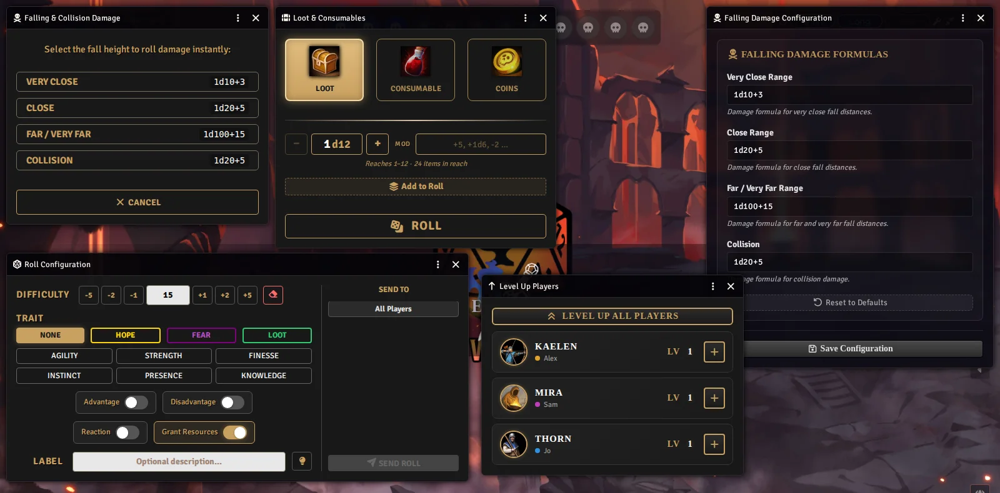
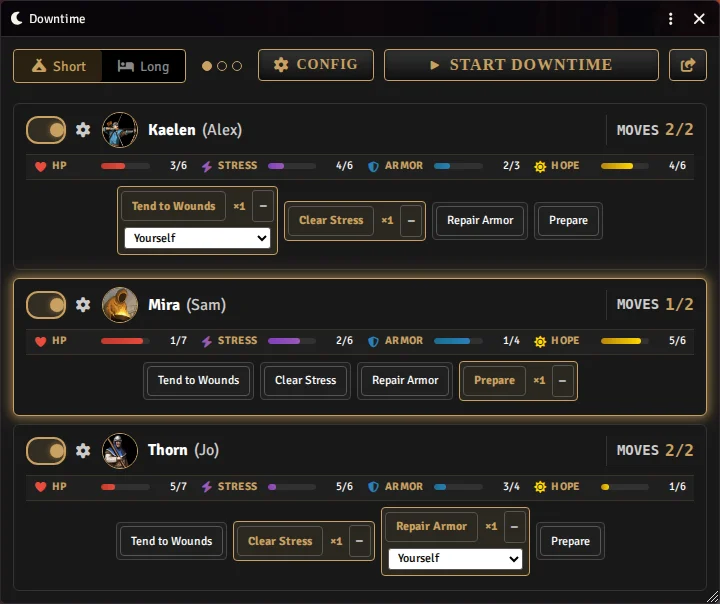
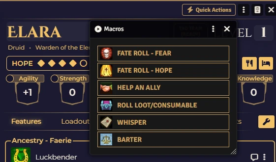
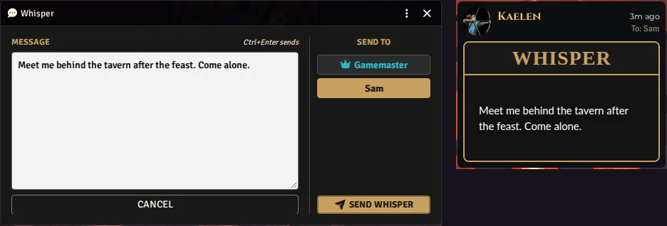
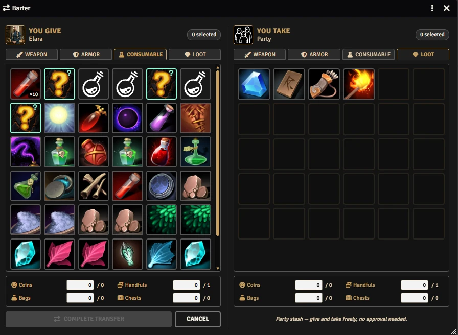
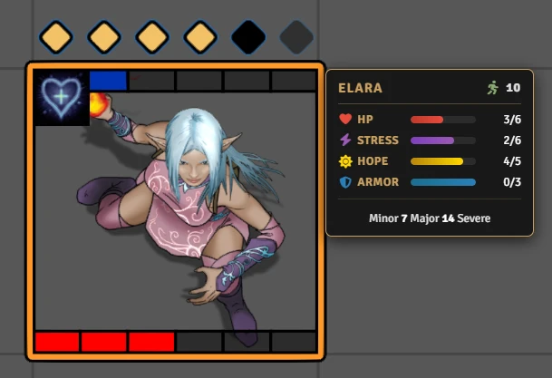
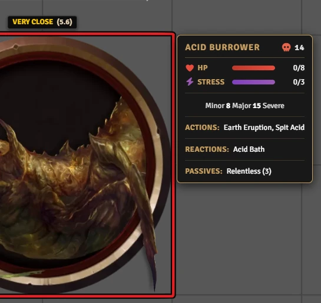
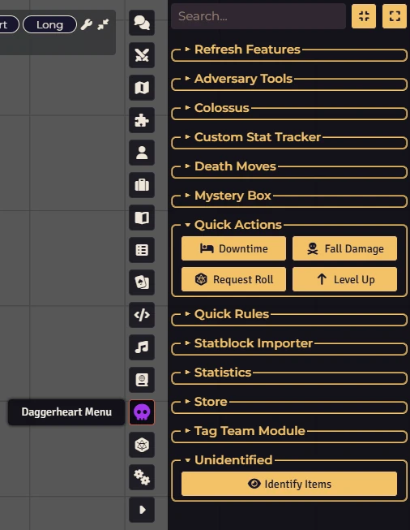

# Daggerheart: Quick Actions

Daggerheart: Quick Actions gathers the table chores of a Daggerheart session into one module: downtime for the whole party, falling damage, roll requests, loot, scar checks, Help an Ally, and more. Most of them are one click away, in the Daggerheart menu in the sidebar, on the party sheet, or behind a button in the header of every character sheet.

<p align="center"></p>

<p align="center"></p>

<p align="center"></p>

[](https://buymeacoffee.com/mestredigital) [](https://mestredigital.online/pages/projetos-en)

## What's in the module

### Downtime

The Downtime UI is a full-screen manager for downtime moves. Players pick their moves (Tend to Wounds, Prepare, Work a Trade, and more, including any homebrew moves the GM adds), the same move can be chosen more than once when the rules allow it, and the GM resolves everything with one click: resource costs, Fear gained and rest results. It also handles the features and items that hook into downtime: Efficient, Forager, Recovery, Armorer, Celestial Trance, Premium Bedroll, Eloquent, Soothing Speech, the Warlock's Favor, the Shapeshifter's Change Shape and Only Skin Deep, Duneborne's Oasis reroll, Timekeeper's Pendant, Pipeweed, and Self-Healing armour.

- The GM can pick moves, targets and feature options on any player's row. That covers a player who is absent: switch their row on with its **Include** toggle (offline players start excluded) and choose their moves for them. Players still edit only their own row. If the GM and that player change the same row at the same moment, the last click wins.
- The gear button in the toolbar opens the Downtime Config window. Its **Core** tab points each supported feature at homebrew or renamed items. **Craft** pairs a recipe item with what it crafts, so an actor holding the recipe gets the item on their sheet. **Custom** adds freeform moves, and **Item Moves** adds moves that only appear for actors who own a given item. **Users** excludes table members who should never take part in a rest, such as spectators or a second screen.
- The pips beside the Short / Long switch count consecutive short rests. The GM can click them to correct the count by hand.

For a GM who only wants to roll Fear without opening the full Downtime UI, there is also a lightweight Short Rest / Long Rest dialog that earns Fear.

### GM tools

- Falling and collision damage: an instant damage roller for environmental hazards, with Very Close, Close, Far/Very Far and Collision tiers. The GM can change the dice formula of each tier.
- Request Roll asks one or more players to make a roll. Set the Difficulty, Trait, Advantage or Disadvantage, and a label for context. When the roll's case has an image assigned (see Cinematic Roll Images in the settings; all nine cases ship with one), it is sent as a full-screen cinematic prompt instead of a plain chat message.
- Whisper sends a private message to any number of connected users, with `QuickActions.Whisper()`. Pick the recipients from the list (GMs are marked with a crown), type the message and send it. It arrives as a whispered chat card that only they can see. The text is plain: anything you type is delivered literally, so pasted HTML shows up as text instead of being rendered. Ctrl+Enter sends without leaving the keyboard.

  <p align="center"></p>

- Barter trades items and coins, with `QuickActions.Barter()`. You need a linked `character` actor. Your inventory shows as a grid of icons split into **Weapons**, **Armor**, **Consumables** and **Loot** tabs. Click an icon to put it on the table (selected items get a green border, and stacks get a small quantity stepper), and offer coins alongside them in whichever currencies the world has enabled. The **Trade With** list then lets you pick one of two kinds of partner:
  - Another player, who also needs a linked `character` actor. Click **Start Trade** and the same window opens on their screen with your offer already laid out. They can add items and coins of their own or accept as it is. Once they confirm, you approve and the swap happens. Any edit after a confirmation cancels it, so nobody can lock in an offer and then quietly change it. A GM must be connected, because the GM's client writes the transfer in a single batch, so it either goes through completely or not at all.
  - A party stash: any party sheet that lists your character as a member and that you hold Owner permission on. There is no invite and no approval step. The right-hand column becomes the party's own inventory, so you give from the left and take from the right in the same window, then click **Complete Transfer**. Your own client writes it, so no GM needs to be online. If a party you expect is missing from the list, check its ownership: without Owner permission on the party actor the option is hidden, since the transfer could not be written.

  Either way the result is posted to chat as a receipt.

  <p align="center"></p>

- Level Up walks a player character through leveling up, straight from the menu.
- Loot & Consumables rolls loot, consumables, or coins by tier and hands out the results, adding them to the receiving sheet when possible. Loot and consumables come from the Daggerheart system's own roll tables, chosen in **Loot & Consumables Configuration**. Click **+** to stack more d12s and reach rarer entries further down the table, up to 5d12, since the tables hold 60 entries ordered by rarity. The **Mod** field beside the stepper covers what the stepper cannot do, because it only moves twelve at a time: type `+5` to shift the band, `+1d6` for a spread between 1d12 and 2d12, or `-2` to pull the band down. The hint underneath always reports what the combined formula reaches. `+5` reads "Reaches 6–17", and a formula that overshoots the table reads "Reaches 60–60", which tells you the dice no longer decide anything. **Add to Roll** stacks several draws ("3d12 loot, then 2d12+5 loot, then Tier 2 coins"), and a single **ROLL** resolves them all into one chat card. When your character belongs to a party sheet you own, a toggle sends the haul to the party stash instead of your own sheet, and the card records which.
- Custom Tables rolls the GM's own roll tables (homebrew loot, a third-party adventure's treasure list, a translated table) and hands out what they give. It is separate from Loot & Consumables on purpose. That roller reads the Daggerheart tables as one scale ordered by rarity, while this one rolls each table with its own formula, exactly as its author built it, and follows nested tables too. Pick a table, click **+** for more draws, and **Add to Roll** stacks draws from several tables into one **ROLL** and one chat card, with the same **To Myself** / **To Party** choice. The GM picks the tables in **Custom Tables Configuration**. Results that point at an Item land on the sheet; anything else is only reported in the card. Open it with the **Custom Tables** macro from this module's Macros compendium, or with `QuickActions.CustomTables()`.
- Spend Hope is a quick picker for spending 1 to 6 Hope from the selected token's actor.
- Templates places attack templates (cone, line, circle, rectangle, and more) on the scene, using Daggerheart's `@Template[...]` chat code syntax.

### Token macros

- Scan reveals a target's physical and mental state through descriptions instead of exact HP and Stress values. The GM must enable it in the settings. It answers the "I look at the goblin, how does it look?" moments.
- Help an Ally spends 1 Hope from the selected token, if it has one, and rolls the Help Die (1d6) to chat.
- Scar Check rolls 1d12 against the actor's Level to decide whether they stay safe or take a Scar.
- Spotlight Token hands the active combat turn to the selected token. It needs an active combat.
- Hovering over a token shows a quick summary of its stats: HP, Stress and more. Adversaries get their own version, listing damage thresholds and every Action, Reaction and Passive they have. The GM turns the tooltip on or off for the world, and each user picks its size.
- A row of Hope diamonds sits just above every character token, filled for the Hope currently held and empty for the rest. It follows each token's own **Display Bars** setting, so it appears and disappears together with the native Hit Points and Stress bars. Scars are shown rather than hidden: instead of shortening the row, the slots a Scar locked are faded out, and healing the Scar brings them back. It can be turned off in the settings.

<p align="center"></p>

<p align="center"></p>

### Class feature macros

These run through `QuickActions.Features()` and are meant to be wired to specific subclass items or macros.

Unleash Chaos recharges the "Unleash Chaos" item to its maximum charge, which depends on the actor's spellcasting trait. It asks what the player pays (1 Stress by default, 1 HP, or nothing for the free recharge at the start of a session) and posts a summary to chat.

Chain Lightning resolves the Arcana card after the player casts it from the sheet. Select the caster's token and run `QuickActions.Features("Chain Lightning")`. The window reads the caster's last Chain Lightning Spellcast Roll from chat, or you type it.

Every hostile adversary within Close range that the Spellcast Roll beats makes a reaction roll against the Spellcast result. Those who fail take one shared 2d8+4 magic damage roll, with resistance, immunity and thresholds applied by the system. The lightning then jumps to adversaries not yet targeted within Close range of anyone who took damage, until nobody is left in range. A results card goes to chat. Clicking a target's token image pans the map to it, and the GM can undo the damage each target took.

With Daggerheart Distances active, Close range is measured the way its rings show it, including elevation when its 3D mode is on. Otherwise the system's own range check is used. With Sequencer and JB2A (Patreon or free) active, the lightning is animated jumping from the caster to each target and along the chain, and every target that takes damage catches fire, with sound effects.

### Where it shows up in the interface

<p align="center"></p>

- The Daggerheart System Menu in the sidebar ("GM Tools") gets a Quick Actions section, a compact grid of 2×2 buttons for Downtime, Fall Damage, Request Roll and Level Up.
- With several modules installed, that shared menu can grow into a long list of sections that is hard to scan. This module adds a search bar, sections that collapse (remembered per user), and a fixed order (the system's own "Refresh Features" always first, everything else in alphabetical order) to the whole menu, including the sections other modules add.
- On the party sheet, the built-in Short Rest and Long Rest buttons are replaced by a single **Downtime** button (GM only) that opens the full Downtime UI.
- Every character sheet gets a **Quick Actions** button in its header, next to the controls (three dots) button. It opens a palette with the macros the GM picked in the settings, the same window `QuickActions.ShowMacros()` produces, one click away for every player. The GM can turn the button off entirely.
- You can build your own palette of buttons for any macro with `QuickActions.ShowMacros()`.

### Optional integrations

If the [Light Sources](https://github.com/brunocalado/light-sources) module is installed and active, every item that gives light in this module's Items compendium is registered with it automatically: Candle, Torch, Alistair's Torch, Hooded Lantern, Bullseye Lantern, Storm Lantern, Oil Lamp, Candelabra, Miner's Helmet, Tactical Flashlight, Smartphone, Matches, Glowstick, and Emergency Flare. So are four *Hope & Fear* items from the Daggerheart system's own compendiums: Mandragorian Torch, Warding Candle, Glowmoss Mushroom, and Sunlight Orb. Equip one from the Token HUD and it lights up, with no manual configuration.

## Settings

Most of the module works out of the box. A few things can be tuned in **Configure Settings** → **Module Settings** → **Daggerheart: Quick Actions**:

- **Quick Actions Macros** (GM) chooses which macros the **Quick Actions** button on character sheets lists. Drag macros in from the Macro directory or from any compendium, remove the ones you don't want, and use **Preview** to see the resulting palette. **Reset to Default** restores the macros the module ships with (Fate Roll - Hope, Fate Roll - Fear, Help an Ally, Roll Loot/Consumable, Whisper, and Barter), and **Clear All** empties the list. The button at the bottom turns the whole feature off: open character sheets lose the button immediately, for every user.
- **Token Hover Tooltip** turns the tooltip on or off for the world (GM), and **Token Tooltip Size** sets its size for you, from Small to Massive.
- **Token Hope Bar** (GM) draws the Hope diamonds above character tokens, on by default. Turn it off if another module already shows Hope on your tokens, such as Bar Brawl. It applies immediately, on every client.
- **Interface Settings** (GM) is one window with the world-wide interface changes this module makes:
  - **Daggerheart Menu Enhancements** is a single switch that turns off all of this module's changes to the system's sidebar menu: the purple skull tab icon, the search bar, the alphabetical order, the sections that collapse, and the two-column button grid. The module's own Quick Actions section stays in the menu either way; only its layout falls back to the system default. It takes effect immediately, on every client.
  - **Biography Tab Visibility** decides how the Biography tab behaves on character sheets: *Each user decides* (default), *Always visible for everyone*, or *Always hidden for everyone*.
- **Hide Biography Tab** (per user) hides the Biography tab on character sheets for you only. It is off by default and only counts while the GM leaves the world setting on *Each user decides*. It stays in the settings list, not in the GM-only Interface Settings window, so every player can reach it.
- **Scan Labels Configuration** enables the Scan macro for players and changes the labels and descriptions it shows.
- **Falling Damage Configuration** changes the dice formula for each fall height tier, with a reset to the official defaults.
- **Loot & Consumables Configuration** (GM) is one window for everything `QuickActions.LootConsumable()` rolls. **Table Source** picks which Daggerheart roll tables loot and consumables come from: *Core Set only*, *Hope & Fear only*, or *Core Set + Hope & Fear* (default). With both enabled the two books share one rarity scale instead of being chained end to end, so a `1d12` sees 24 common items instead of 12, and a visible coin flip then decides which book the entry comes from (tails Core Set, heads Hope & Fear). **Coin Tier Ranges** sets the minimum and maximum coins rolled for each tier.
- **Custom Tables Configuration** (GM) chooses the roll tables `QuickActions.CustomTables()` draws from. Drag tables in from the **Rollable Tables** directory or from any compendium, and remove the ones you don't want. A table that was deleted, or whose compendium is gone, is flagged instead of dropped silently. Three things are worth knowing before you add one:
  - Players need to see the table. A roll table created in the sidebar starts with no player access, so it works for you and fails for them. Set its ownership to **Observer**. Do the same for the compendium holding the items it hands out, which is a single setting for the whole pack.
  - Only Items are handed out. A result that points at an Item is added to the sheet. Text entries, or links to actors and journals, appear in the chat card but nothing is written.
  - Every draw is independent. A table set to draw without replacement still repeats, because the roller never writes back to your table.
- **Cinematic Roll Images** assigns an image to each Request Roll case: the six traits, Hope, Fear, and the generic Duality Roll fallback. Every case ships with a core Foundry icon, so the full-screen cinematic prompt works out of the box. Point a case at your own artwork to replace it, or clear it to fall back to a plain chat message. **Reset to Default** restores all nine stock icons (worlds created before 0.6.7 start out blank and need this once), and **Clear All** blanks every case, which turns the feature off.

## How to use it

### From the sidebar

Open the Daggerheart menu in the sidebar (also called "GM Tools"). The Quick Actions section has buttons for:

- Downtime
- Fall Damage
- Request Roll
- Level Up

The whole menu also gets a search bar and sections in alphabetical order that collapse, which helps once several modules add to it. Click a section's title to collapse or expand it (remembered per user), or type in the search box to jump straight to what you need.

### From the party sheet

GMs find a **Downtime** button on the party sheet's action bar, in place of the default Short Rest and Long Rest buttons. It opens the full Downtime UI for the whole party.

### From a character sheet

Every character sheet has a **Quick Actions** button in its header. It opens a palette with the macros set in **Configure Settings** → **Daggerheart: Quick Actions** → **Quick Actions Macros**, ready to run. The list starts with the module's own macros. The GM can drag in any world or compendium macro, or turn the button off.

### From macros

Every function can be called from a Foundry macro or from code, through the global `QuickActions` object:

```javascript
// Opens the full Downtime UI
QuickActions.DowntimeUI();
```

```javascript
// Opens the lightweight "Earn Fear" (Short/Long Rest) dialog
QuickActions.Downtime();
```

```javascript
// Opens the Falling Damage calculator
QuickActions.FallingDamage();
```

```javascript
// Opens the Roll Request dialog. The cinematic full-screen prompt activates automatically per
// request, based on the images configured in Configure Settings → Cinematic Roll Images.
QuickActions.RequestRoll();
```

```javascript
// Opens the Whisper window — pick connected users and send them a plain-text private message.
QuickActions.Whisper();
```

```javascript
// Opens the Barter window — trade items and coins with another connected
// player, or with a party stash your character belongs to.
QuickActions.Barter();
```

```javascript
// Opens the Loot & Consumables roller
QuickActions.LootConsumable();
```

```javascript
// Opens the Custom Tables roller — rolls the roll tables the GM curated in
// Configure Settings → Daggerheart: Quick Actions → Custom Tables Configuration.
// Each table is rolled with its own formula, so any table works, not just SRD-shaped ones.
QuickActions.CustomTables();
```

```javascript
// Performs "Help an Ally" on the selected token
QuickActions.HelpAnAlly();
```

```javascript
// Performs a "Scar Check" on the selected token
QuickActions.ScarCheck();
```

```javascript
// Sets the combat turn to the selected token
QuickActions.SpotlightToken();
```

```javascript
// Choose a number of Hope to spend on the selected token
QuickActions.SpendHope();
```

```javascript
// Adds a template to the scene
QuickActions.Templates();
```

```javascript
// Opens a level-up flow for a player character
QuickActions.LevelUp();
```

```javascript
// Rolls a Hope/Fear Duality die with a cinematic animation
// rollType: "hope" or "fear" | mode: "default" (animated), "ask" (choose the die), "system" (use the system's own roll)
QuickActions.Fate("hope");
```

```javascript
// Runs one of the built-in class feature macros (e.g. subclass abilities)
// See "Class Feature Macros" above for the available names.
QuickActions.Features("Unleash Chaos");
QuickActions.Features("Chain Lightning");
```

```javascript
// Opens a dialog with buttons for specific macros by name
// To use the macro name it requires the macros to exist in the 'daggerheart-quickactions.macros' compendium. You can use the UUID to add any macro from world or any compendium.
// 
QuickActions.ShowMacros("Macro Name 1", "Macro Name 2", "Macro.CDcmq4UiZMqs6pbs", "Compendium.daggerheart-quickactions.macros.Macro.5SyMBdCHM5TZXqGz");
```

```javascript
// Opens the same palette as the "Quick Actions" button on character sheets,
// listing the macros the GM curated in Configure Settings → Quick Actions Macros.
QuickActions.QuickActionsMenu();
```

```javascript
/* WARNING: This will only work if you enable the module setting.
This allows the player to obtain information about a targeted adversary token. 
They will be informed about the HP and Stress status without revealing numerical values. 
During the game, it is common for players to ask: "I look at the goblin, how does it look?" 
The GM usually responds: "He looks quite wounded and exhausted." 
This macro aims to give players the autonomy to do this themselves. 
Example output: 
Physical State: Injured 
Mental State: Completely overwhelmed, paralyzed by panic and unable to think clearly 
*/

QuickActions.Scan();
```

## Installation

Install it from the Foundry VTT module browser, or use this manifest link:

```javascript
https://github.com/brunocalado/daggerheart-quickactions/releases/latest/download/module.json
```

It needs Foundry VTT v14 and the Daggerheart system 2.9.2 or later. Dice So Nice and Light Sources are recommended but not required.

## ⚖️ Credits & License

* **Code License:** GNU GPLv3.

* **Chain Lightning sounds:** [Basic Spell Impacts](https://lentikula.itch.io/freecc0-basic-spell-impacts-sfx) by lentikula, released under CC0.

* **System:** Designed for the [Daggerheart](https://www.daggerheart.com) system on Foundry VTT.

**Disclaimer:** This module is an independent creation and is not affiliated with Darrington Press.

# 🧰 My Daggerheart Modules

| Module | Description |
| :--- | :--- |
| 💀 [**Adversary Manager**](https://github.com/brunocalado/daggerheart-advmanager) | Scale adversaries instantly and build balanced encounters. |
| 🖼️ [**Art Mapper**](https://github.com/brunocalado/dh-assets) | Automatically assigns artwork to system compendiums, actors, tokens, and custom module content — keeping your visuals organized and up to date. |
| 🐉 [**Colossus**](https://github.com/brunocalado/dh-colossus) | Manage massive multi-part boss encounters with independent HP per part and a single shared stress pool. |
| 📦 [**Containers**](https://github.com/brunocalado/dh-containers) | Group inventory items into collapsible containers — pouches, chests, backpacks — to declutter character sheets. |
| 💥 [**Critical**](https://github.com/brunocalado/daggerheart-critical) | Animated criticals. |
| 💠 [**Custom Stat Tracker**](https://github.com/brunocalado/dh-new-stat-tracker) | Add custom trackers to actors. |
| ☠️ [**Death Moves**](https://github.com/brunocalado/daggerheart-death-moves) | Enhances the Death Move moment with a dramatic interface and full automation. |
| 📏 [**Distances**](https://github.com/brunocalado/daggerheart-distances) | Visualizes combat ranges with customizable rings and hover calculations. |
| 📦 [**Extra Content**](https://github.com/brunocalado/daggerheart-extra-content) | Homebrew content pack. |
| 😱 [**Fear Tracker**](https://github.com/brunocalado/daggerheart-fear-tracker) | Adds an animated slider bar with configurable fear tokens to the UI. |
| 🧟 [**Horde**](https://github.com/brunocalado/dh-horde) | Explode single horde tokens into dozens of individual tokens and manage their movement and stats automatically. |
| 🎁 [**Mystery Box**](https://github.com/brunocalado/dh-mystery-box) | Introduces mystery box mechanics for random loot and surprises. |
| ⚡ [**Quick Actions**](https://github.com/brunocalado/daggerheart-quickactions) | Quick access to common mechanics like Falling Damage, Downtime, etc. |
| 📜 [**Quick Rules**](https://github.com/brunocalado/daggerheart-quickrules) | Fast and accessible reference guide for the core rules. |
| 🤖 [**Resource Macros**](https://github.com/brunocalado/daggerheart-fear-macros) | Automatically executes macros when the Fear or Hope resources change. |
| 🎲 [**Stats**](https://github.com/brunocalado/daggerheart-stats) | Tracks dice rolls from GM and Players. |
| 🧠 [**Stats Toolbox**](https://github.com/brunocalado/dh-statblock-importer) | Import actors using a statblock. |
| 🛒 [**Store**](https://github.com/brunocalado/daggerheart-store) | A dynamic, interactive, and fully configurable in-game store. |
| 🔍 [**Unidentified**](https://github.com/brunocalado/dh-unidentified) | Obfuscates item names and descriptions until they are identified by the players. |
| 🌌 [**Void**](https://github.com/brunocalado/the-void-unofficial) | Unofficial module that brings The Void playtesting content — experimental classes, subclasses, ancestries, communities, adversaries, loot, weapons, and more. |

# 🗺️ Adventures

| Adventure | Description |
| :--- | :--- |
| ✨ [**I Wish**](https://github.com/brunocalado/i-wish-daggerheart-adventure) | A wealthy merchant is cursed; one final expedition may be the only hope. |
| 💣 [**Suicide Squad**](https://github.com/brunocalado/suicide-squad-daggerheart-adventure) | Criminals forced to serve a ruthless master in a land on the brink of war. |
